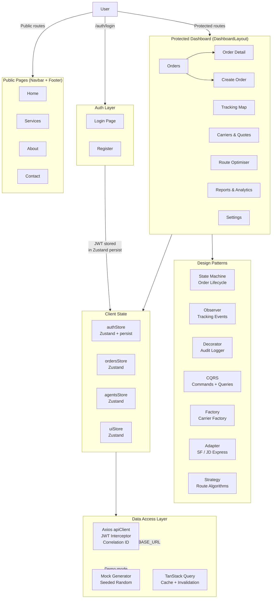
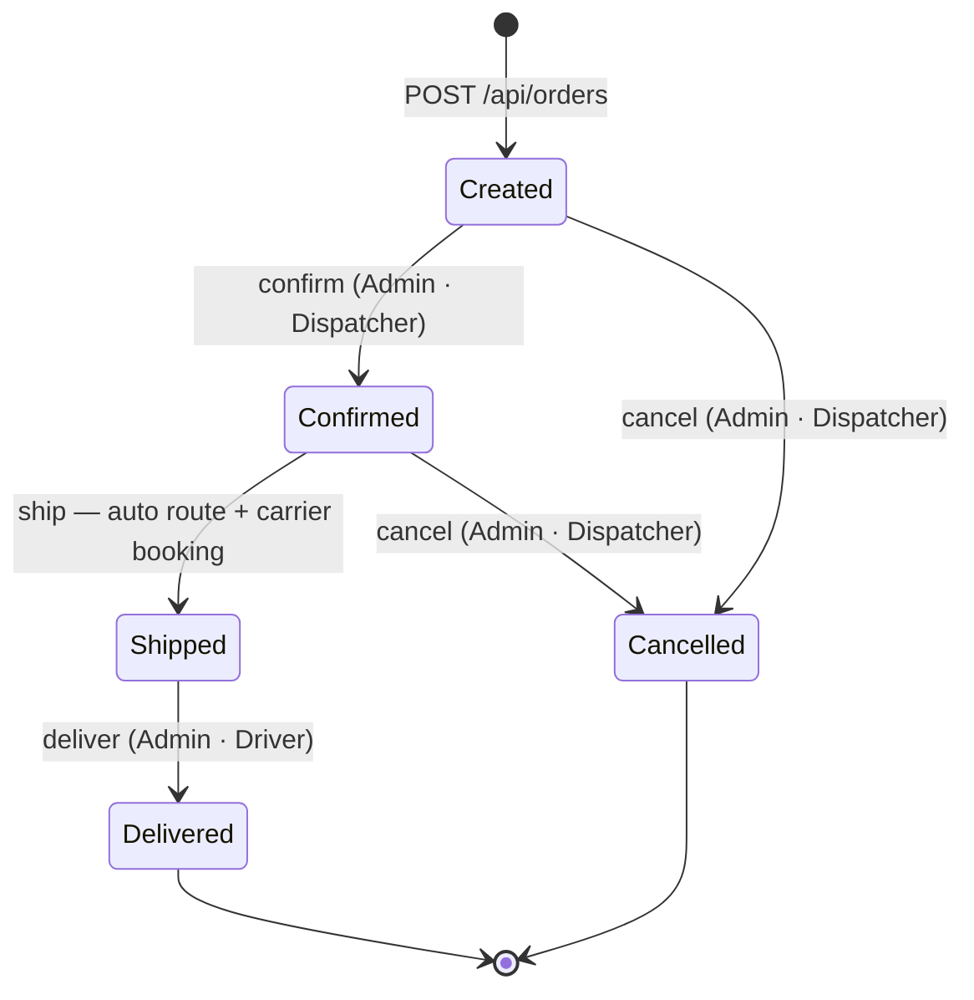

# DT-Express TMS — Frontend

> **Transportation Management System · React · TypeScript · Vite**

[](https://react.dev)
[](https://www.typescriptlang.org)
[](https://vitejs.dev)
[](https://tailwindcss.com)
[](LICENSE)
[](https://nodejs.org)
[](./api-reference.md)

---

## Table of Contents

- [Overview](#-overview)
- [Features](#-features)
- [Tech Stack](#️-tech-stack)
- [Architecture](#-architecture)
- [Quick Start](#-quick-start)
- [Project Structure](#-project-structure)
- [Security Features](#-security-features)
- [Design Patterns](#-design-patterns)
- [API Documentation](#-api-documentation)
- [Demo Accounts](#-demo-accounts)
- [Related Resources](#-related-resources)
- [License & Credits](#-license--credits)

---

## 🎯 Overview

**DT-Express TMS** is a fully-featured **Transportation Management System** frontend built with React 18 and TypeScript. It visualizes the complete logistics workflow — from order creation and carrier booking through real-time GPS tracking and revenue analytics — all driven by a **mock-first architecture** that mirrors the production API contract ([`api-reference.md`](./api-reference.md)) without requiring a live backend.

> **Demo Mode:** All data is generated client-side with seeded randomness and in-memory state. The app is ready to plug into the real `.NET 8` backend by setting a single environment variable.

**Key use cases:**
- Prototype and validate the TMS UI against the API contract before backend deployment
- Demonstrate logistics domain concepts (order lifecycle, carrier comparison, route optimisation) to stakeholders
- Serve as a reference implementation for GoF design patterns in a production-grade React codebase

---

## ✨ Features

- **🗂️ Full Order Lifecycle** — Create orders with a multi-step wizard, filter/search across all statuses, and drive state transitions (Confirm → Ship → Deliver / Cancel) with role-enforcement
- **🗺️ Real-Time Agent Tracking** — Interactive MapLibre GL map rendering 60 seeded delivery agents across Shanghai, Beijing, Guangzhou, Shenzhen, and Chengdu with live simulated movement
- **🚚 Carrier Quote Comparison** — Side-by-side quotes from SF Express and JD Logistics; one-click booking via the Adapter pattern
- **🧭 Route Optimisation** — Compare three strategies (Fastest · Cheapest · Balanced) with visual route overlays and cost/time breakdowns
- **📊 Revenue & Shipment Analytics** — Monthly shipment charts, carrier revenue pie charts, and CSV export via Recharts
- **🔐 Role-Based Access Control** — Four roles (Admin, Dispatcher, Driver, Viewer) with fine-grained permission checks on every action and route
- **📋 Audit Logging** — Decorator pattern wraps every mutation with correlation IDs, performance timing, and a searchable in-memory audit trail
- **⚡ Virtualised Order List** — TanStack Virtual renders thousands of rows at 60 fps without pagination

---

## 🛠️ Tech Stack

### Frontend

| Layer | Technology |
|-------|-----------|
| Framework |  |
| Language |  |
| Build Tool |  |
| Styling |  |
| Routing |  |

### State & Data

| Layer | Technology |
|-------|-----------|
| Global State |  |
| Server State / Cache |  |
| HTTP Client |  |
| Schema Validation |  |

### Visualisation & UX

| Layer | Technology |
|-------|-----------|
| Maps |  + react-map-gl |
| Charts |  |
| Animations |  |
| Icons |  |
| Toasts | Sonner |
| Virtualisation | TanStack Virtual |

---

## 🏗 Architecture

### High-Level Layout



### Data Flow — Order State Machine



### Key Design Decisions

| Decision | Choice | Rationale |
|----------|--------|-----------|
| State management | Zustand (per-domain stores) | Minimal boilerplate, fine-grained subscriptions |
| Server cache | TanStack Query | Stale-while-revalidate, background refetch |
| Map renderer | MapLibre GL (open-source) | No Mapbox API key required for demo |
| Mock data | Seeded pseudorandom (Park-Miller) | Deterministic output across refreshes |
| Pattern isolation | `src/lib/patterns/` | Patterns are independently testable, zero UI dependencies |

---

## 🚀 Quick Start

### Prerequisites

| Tool | Version |
|------|---------|
| Node.js | ≥ 18 LTS |
| npm | ≥ 9 (or pnpm / yarn) |
| Git | any |

### Installation

```bash
# 1. Clone the repository
git clone https://github.com/<your-org>/DT-Express-React-Typescript.git
cd DT-Express-React-Typescript

# 2. Install dependencies
npm install

# 3. (Optional) Create a .env.local file — defaults work for demo mode
cp .env.example .env.local
```

### Environment Variables

| Variable | Default | Description |
|----------|---------|-------------|
| `VITE_API_BASE_URL` | `http://localhost:5198` | Backend base URL. Omit or leave as default to use mock data. |

> **Demo mode** — the app works fully offline without any backend. All API calls fall back gracefully and display seeded mock data.

### Running Locally

```bash
# Development server with HMR
npm run dev
# → http://localhost:5173

# Type-check + production build
npm run build

# Preview the production build
npm run preview

# Lint
npm run lint
```

---

## 📁 Project Structure

```
src/
├── App.tsx                    # Root router — public + dashboard + auth routes
├── main.tsx                   # React entry point
├── index.css                  # Tailwind base styles
│
├── app/                       # Page-level route components (feature folders)
│   ├── auth/
│   │   └── LoginPage.tsx
│   ├── carriers/
│   │   └── CarriersPage.tsx
│   ├── orders/
│   │   ├── CreateOrderPage.tsx
│   │   ├── OrderDetailPage.tsx
│   │   └── OrdersPage.tsx
│   ├── reports/
│   │   └── ReportsPage.tsx
│   ├── routing/
│   │   └── RoutingPage.tsx
│   ├── settings/
│   │   └── SettingsPage.tsx
│   └── tracking/
│       └── TrackingPage.tsx
│
├── components/                # Reusable UI components
│   ├── auth/
│   │   └── RequirePermission.tsx   # RBAC guard wrapper
│   ├── carriers/
│   │   ├── CarrierCard.tsx
│   │   ├── QuoteComparison.tsx
│   │   └── QuoteForm.tsx
│   ├── layout/
│   │   ├── DashboardHeader.tsx
│   │   ├── DashboardLayout.tsx     # Sidebar + header shell
│   │   ├── Footer.tsx
│   │   ├── Navbar.tsx
│   │   └── Sidebar.tsx
│   ├── orders/
│   │   ├── ActionButtons.tsx       # State-machine-driven CTA buttons
│   │   ├── CreateOrderSteps.tsx    # Multi-step wizard
│   │   ├── OrderFilters.tsx
│   │   ├── OrderRow.tsx
│   │   ├── OrderTimeline.tsx
│   │   └── VirtualizedOrderList.tsx
│   ├── reports/
│   │   ├── DateRangePicker.tsx
│   │   ├── MonthlyShipmentsChart.tsx
│   │   └── RevenuePieChart.tsx
│   ├── routing/
│   │   ├── RouteComparison.tsx
│   │   ├── RouteMap.tsx
│   │   └── StrategyCard.tsx
│   ├── tracking/
│   │   ├── AgentCard.tsx
│   │   ├── AgentMarker.tsx
│   │   └── InteractiveMap.tsx      # MapLibre GL live map
│   └── ui/
│       ├── Modal.tsx
│       └── Select.tsx
│
├── hooks/                     # Custom React hooks (data-fetching + business logic)
│   ├── useCarriers.ts
│   ├── useOrder.ts
│   ├── useOrders.ts
│   ├── useReports.ts
│   ├── useRouting.ts
│   └── useTracking.ts
│
├── lib/
│   ├── api/                   # Axios API modules (mirrors api-reference.md)
│   │   ├── auth.ts
│   │   ├── carriers.ts
│   │   ├── index.ts           # Axios client, JWT interceptor, correlation ID
│   │   ├── orders.ts
│   │   ├── reports.ts
│   │   ├── routing.ts
│   │   └── tracking.ts
│   ├── audited/
│   │   └── auditedOrdersApi.ts     # Decorator-wrapped order mutations
│   ├── constants/
│   │   └── index.ts               # Roles, permissions, status labels, colours
│   ├── mock/
│   │   └── trackingGenerator.ts   # 60 seeded agents across 5 Chinese cities
│   ├── patterns/              # GoF pattern implementations
│   │   ├── adapter/
│   │   │   ├── CarrierAdapter.ts      # Common carrier interface
│   │   │   ├── JDLogisticsAdapter.ts
│   │   │   └── SFExpressAdapter.ts
│   │   ├── cqrs/
│   │   │   ├── commands/
│   │   │   │   └── CreateOrderCommand.ts
│   │   │   └── queries/
│   │   │       └── GetOrdersQuery.ts
│   │   ├── decorator/
│   │   │   └── AuditDecorator.ts
│   │   ├── factory/
│   │   │   └── CarrierFactory.ts
│   │   ├── observer/
│   │   │   └── TrackingObserver.ts
│   │   ├── state/
│   │   │   └── OrderStateMachine.ts
│   │   └── strategy/
│   │       ├── BalancedStrategy.ts
│   │       ├── CheapestStrategy.ts
│   │       ├── FastestStrategy.ts
│   │       └── RouteStrategy.ts
│   └── utils/
│       ├── cn.ts              # Tailwind class merger (clsx + tailwind-merge)
│       ├── csv.ts             # CSV export utilities
│       ├── routeGeometry.ts
│       └── validation.ts      # Zod schemas
│
├── pages/                     # Public marketing pages
│   ├── About.tsx
│   ├── Contact.tsx
│   ├── Home.tsx
│   └── Services.tsx
│
├── stores/                    # Zustand global stores
│   ├── agentsStore.ts         # Delivery agent positions + status
│   ├── authStore.ts           # JWT, user, roles (persisted to localStorage)
│   ├── ordersStore.ts         # Orders cache + optimistic updates
│   └── uiStore.ts             # Sidebar collapsed, modal state, etc.
│
├── types/
│   └── index.ts               # All shared TypeScript interfaces/types
│
└── utils/
    └── csv.ts
```

---

## 🔐 Security Features

### Authentication & Authorisation

- **JWT Bearer tokens** — Access token stored in Zustand persisted state; automatically injected by Axios request interceptor
- **Single-use refresh tokens** — Refresh token rotation on every exchange; consumed token returns `INVALID_REFRESH_TOKEN`
- **Automatic 401 handling** — Response interceptor clears auth state and redirects to `/auth/login` on any 401
- **Role-Based Access Control** — Four roles with 15 granular permission flags enforced at both route and component level via `<RequirePermission>` wrapper

### Request Tracing

- **Correlation IDs** — Every outbound request gets a `crypto.randomUUID()` injected as `X-Correlation-ID`; full request chains are traceable end-to-end
- **Audit Decorator** — Wraps all write operations with timing, success/failure logging, and an in-memory audit log (last 50 entries)

### Input Validation

- **Zod v4 schemas** — All form data validated client-side before any API call
- **Chinese phone regex** — `1[3-9]\d{9}` enforced on customer phone fields
- **Weight/dimension invariants** — Dimensions are all-or-nothing; weight > 0; quantity ≥ 1

### Webhook Security (backend contract)

The backend expects `HMAC-SHA256` signatures on carrier webhooks (`X-Webhook-Signature: sha256={hex}`); the frontend's mock mode simulates signed events locally.

### Permission Matrix

| Permission | Admin | Dispatcher | Driver | Viewer |
|------------|:-----:|:----------:|:------:|:------:|
| View all orders | ✅ | ✅ | ❌ | ❌ |
| Create order | ✅ | ✅ | ❌ | ❌ |
| Confirm / Ship / Cancel | ✅ | ✅ | ❌ | ❌ |
| Mark Delivered | ✅ | ❌ | ✅ | ❌ |
| View revenue / reports | ✅ | ❌ | ❌ | ❌ |
| Export CSV | ✅ | ✅ | ❌ | ❌ |
| Tracking map | ✅ | ✅ | ✅ | ✅ |
| Compare carriers | ✅ | ✅ | ❌ | ❌ |
| Calculate routes | ✅ | ✅ | ❌ | ❌ |
| Manage settings | ✅ | ❌ | ❌ | ❌ |

---

## 🏛 Design Patterns

Seven GoF / enterprise patterns are implemented in `src/lib/patterns/`, fully decoupled from React:

| Pattern | Location | Purpose |
|---------|----------|---------|
| **State Machine** | `patterns/state/` | Type-safe order lifecycle transitions with role enforcement |
| **Observer** | `patterns/observer/` | Decoupled real-time agent update broadcasting (singleton, auto-cleanup) |
| **Decorator** | `patterns/decorator/` | Non-invasive audit logging + correlation ID tracking around any async fn |
| **CQRS** | `patterns/cqrs/` | Separates `CreateOrderCommand` (validate → call → update store) from `GetOrdersQuery` (cache-aware read) |
| **Adapter** | `patterns/adapter/` | Normalises SF Express and JD Logistics APIs to a common `CarrierAdapter` interface |
| **Factory** | `patterns/factory/` | `CarrierFactory` resolves carrier code → adapter instance |
| **Strategy** | `patterns/strategy/` | Pluggable route algorithms: `FastestStrategy`, `CheapestStrategy`, `BalancedStrategy` |

### Audit Decorator Quick Example

```typescript
import { withAudit, getAuditStats } from '@/lib/patterns/decorator/AuditDecorator';
import { ordersApi } from '@/lib/api/orders';

const createWithAudit = withAudit(
  (correlationId) => ordersApi.create(data, correlationId),
  'CreateOrder'
);

await createWithAudit();
// Console: [AUDIT] CreateOrder completed — <uuid> — 234ms

console.log(getAuditStats());
// { total: 1, successful: 1, failed: 0, avgDuration: 234 }
```

---

## 📊 API Documentation

> Full contract: [`api-reference.md`](./api-reference.md)  
> Postman collection: [`DtExpress-TMS.postman_collection.json`](./DtExpress-TMS.postman_collection.json)

**Base URL:** `http://localhost:5198`  
**Auth:** `Authorization: Bearer <access_token>`  
**Content-Type:** `application/json`

All responses use the `ApiResponse<T>` envelope:

```json
{
  "success": true,
  "data": { },
  "error": null,
  "correlationId": "auto-generated-uuid"
}
```

### Key Endpoints

#### Login

```http
POST /api/auth/login
Content-Type: application/json

{
  "username": "admin",
  "password": "admin123"
}
```

```json
{
  "success": true,
  "data": {
    "accessToken": "eyJhbGci...",
    "refreshToken": "a1b2c3d4-...",
    "expiresAt": "2026-02-11T14:00:00+00:00",
    "userId": "a0000000-...",
    "username": "admin",
    "displayName": "系统管理员",
    "role": "Admin"
  }
}
```

#### Create Order

```http
POST /api/orders
Authorization: Bearer <token>

{
  "customerName": "张三",
  "customerPhone": "13812345678",
  "origin": {
    "street": "浦东新区陆家嘴环路1000号",
    "city": "上海",
    "province": "上海",
    "postalCode": "200120",
    "country": "CN"
  },
  "destination": { },
  "serviceLevel": "Express",
  "items": [
    { "description": "Electronics", "quantity": 1, "weight": { "value": 2.5, "unit": "Kg" } }
  ]
}
```

#### Ship Order (triggers auto-routing + carrier booking)

```http
PUT /api/orders/{id}/ship
Authorization: Bearer <token>
```

```json
{
  "success": true,
  "data": {
    "orderId": "b0000000-...",
    "newStatus": "Shipped",
    "carrierCode": "SF",
    "trackingNumber": "SF0000000001"
  }
}
```

#### Compare Route Strategies

```http
POST /api/routing/compare
Authorization: Bearer <token>

{
  "origin":      { "latitude": 31.2304, "longitude": 121.4737 },
  "destination": { "latitude": 39.9042, "longitude": 116.4074 },
  "packageWeight": { "value": 2.5, "unit": "Kg" },
  "serviceLevel": "Express"
}
```

#### Monthly Shipment Report (CSV export)

```http
GET /api/reports/shipments/monthly?month=2026-01&format=csv
Authorization: Bearer <token>
```

#### Full Endpoint Summary (30 endpoints)

| Method | Path | Auth | Description |
|--------|------|:----:|-------------|
| POST | `/api/auth/login` | ❌ | Login |
| POST | `/api/auth/register` | ❌ | Register |
| POST | `/api/auth/refresh` | ❌ | Refresh token |
| POST | `/api/orders` | ✅ | Create order |
| GET | `/api/orders` | ✅ | List + filter orders |
| GET | `/api/orders/{id}` | ✅ | Order detail |
| PUT | `/api/orders/{id}/confirm` | ✅ | Confirm |
| PUT | `/api/orders/{id}/ship` | ✅ | Ship + auto-book carrier |
| PUT | `/api/orders/{id}/deliver` | ✅ | Deliver |
| PUT | `/api/orders/{id}/cancel` | ✅ | Cancel |
| POST | `/api/routing/calculate` | ✅ | Calculate route |
| POST | `/api/routing/compare` | ✅ | Compare strategies |
| GET | `/api/routing/strategies` | ✅ | List strategies |
| GET | `/api/carriers` | ❌ | List carriers |
| POST | `/api/carriers/quotes` | ✅ | Get quotes |
| POST | `/api/carriers/{code}/book` | ✅ | Book shipment |
| GET | `/api/carriers/{code}/track/{no}` | ✅ | Track shipment |
| GET | `/api/tracking/{no}/snapshot` | ✅ | Tracking snapshot |
| POST | `/api/tracking/{no}/subscribe` | ✅ | Subscribe (Observer) |
| GET | `/api/audit/entity/{type}/{id}` | ✅ | Audit by entity |
| GET | `/api/audit/correlation/{id}` | ✅ | Audit by correlation |
| GET | `/api/dashboard/stats` | ✅ | Dashboard stats |
| GET | `/api/dashboard/carrier-performance` | ✅ | Carrier metrics |
| GET | `/api/dashboard/top-customers` | ✅ | Top customers |
| POST | `/api/orders/bulk-create` | ✅ | Bulk create |
| PUT | `/api/orders/{id}/update-destination` | ✅ | Update destination |
| POST | `/api/orders/{id}/split-shipment` | ✅ | Split shipment |
| POST | `/api/webhooks/carrier/{code}` | HMAC | Carrier webhook |
| GET | `/api/reports/shipments/monthly` | ✅ | Monthly report |
| GET | `/api/reports/revenue/by-carrier` | ✅ | Revenue by carrier |
| WS | `/hubs/tracking` | ✅ | SignalR real-time |

---

## 🧑‍💼 Demo Accounts

Log in at `/auth/login` with any of the pre-seeded accounts:

| Username | Password | Role | Display Name | Access Level |
|----------|----------|------|--------------|-------------|
| `admin` | `admin123` | Admin | 系统管理员 | Full access — all 15 permissions |
| `dispatcher` | `passwd123` | Dispatcher | 调度员小李 | Order management, routing, carriers, reports |
| `driver` | `passwd123` | Driver | 司机王师傅 | Tracking map, mark delivered |
| `viewer` | `passwd123` | Viewer | 客服张小姐 | Tracking map (read-only) |

---

## 📚 Related Resources

| Resource | Link |
|----------|------|
| API Contract | [`api-reference.md`](./api-reference.md) |
| Database Schema | [`database-schema.md`](./database-schema.md) |
| Design Patterns Guide | [`DESIGN-PATTERNS.md`](./DESIGN-PATTERNS.md) |
| Development Plan | [`DEVELOPMENT-PLAN.md`](./DEVELOPMENT-PLAN.md) |
| Postman Collection | [`DtExpress-TMS.postman_collection.json`](./DtExpress-TMS.postman_collection.json) |

### Connecting to the Real Backend

When the `.NET 8` backend is running locally:

```bash
# .env.local
VITE_API_BASE_URL=http://localhost:5198
```

The Axios client will automatically:
1. Inject `Authorization: Bearer <token>` from persisted Zustand state
2. Generate and attach `X-Correlation-ID` per request
3. Handle `401` by clearing auth and redirecting to login
4. Unwrap the `ApiResponse<T>` envelope and surface typed `data`

No other configuration changes are needed — the frontend is a thin client over the contract.

---

## 📄 License & Credits

This project is released under the [MIT License](LICENSE).

### Acknowledgements

| Library | Use |
|---------|-----|
| [React](https://react.dev) | UI framework |
| [Vite](https://vitejs.dev) | Build tooling |
| [Tailwind CSS](https://tailwindcss.com) | Utility-first styling |
| [Zustand](https://github.com/pmndrs/zustand) | Lightweight global state |
| [TanStack Query](https://tanstack.com/query) | Server-state caching |
| [MapLibre GL](https://maplibre.org) | Open-source map renderer |
| [Recharts](https://recharts.org) | Composable React charts |
| [Framer Motion](https://www.framer.com/motion/) | Declarative animations |
| [Zod](https://zod.dev) | TypeScript-first schema validation |
| [Lucide React](https://lucide.dev) | Icon system |
| [Sonner](https://sonner.emilkowal.ski) | Toast notifications |

---

<p align="center">
  Built for the <strong>DT-Express</strong> TMS demo · Mock-first, production-ready contract
</p>
